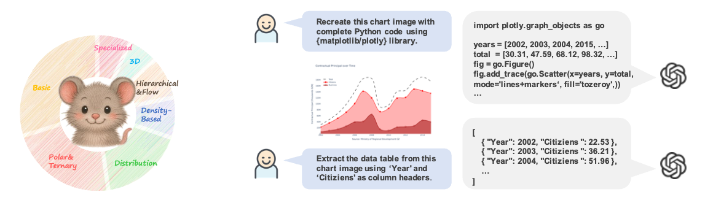

# ChartAnchor: Chart Grounding with Structural-Semantic Fidelity and Data Recovery
<!-- 
[](https://huggingface.co/datasets/xxxllz/Chart2Code-160k)  -->


## News


**[2025.6.16]** We have released our ChartAnchor.

## Overview



## Installation

1. Clone this repository:
   ```bash
   git clone https://github.com/immortal5655/ChartAnchor.git
   cd ChartAnchor
   ```

2. Set up the environment:
   ```bash
   pip install -r requirements.txt
   ```

## Usage

### Chart-to-Code Evaluation

- In `eval/evaluate_single_chart.py`, set the paths to the **ground truth code** (`*.py`) and the **model-generated code** (`*.py`) to evaluate the following metrics:  
  **Functional Validity**, **Visual Structure Consistency** (*Legend, Title, Axis, Annotations*), and **Data Fidelity**.

- In `eval/evaluate_single_image.py`, set the paths to the **ground truth image** and the **image rendered from the model-generated code** to evaluate **Perceptual Similarity**.

### Controlled Chart-to-Table Evaluation

- In `eval/evaluate_single_table.py`, set the paths to the **ground truth table** (`*.json`) and the **model-generated table** (`*.json`) to evaluate metrics for the controlled chart-to-table task.

### Run Evaluation Scripts

```bash
cd eval
python evaluate_single_chart.py
python evaluate_single_image.py
python evaluate_single_table.py
```


 


## Data
|  Dataset  | Download Link  |
|  ----  | ----  |
|ChartAnchor  | [Kaggle](https://www.kaggle.com/datasets/dppppp/mydataset/data) |

## Contact

For any questions, you can contact [lixinhang@mail.ustc.edu.cn](lixinhang@mail.ustc.edu.cn).
